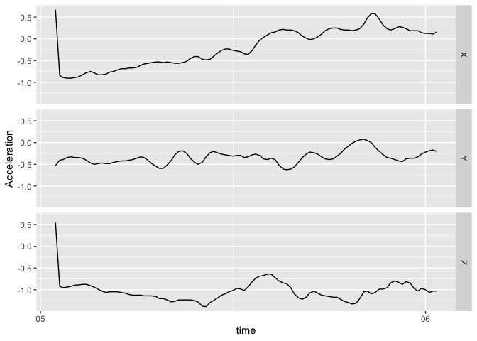

<!-- README.md is generated from README.Rmd. Please edit that file -->

# bis620.2023

<!-- badges: start -->

[](https://github.com/kaneplusplus/bis620.2023/actions/workflows/R-CMD-check.yaml)
<!-- badges: end -->

The goal of bis620.2023 is to …

## Installation

You can install the development version of bis620.2023 from
[GitHub](https://github.com/) with:

``` r
# install.packages("devtools")
devtools::install_github("kaneplusplus/bis620.2023")
```

## Example

This is a basic example which shows you how to solve a common problem:

``` r
library(bis620.2023)
accel |> 
  head(100) |> 
  plot_accel()
```


