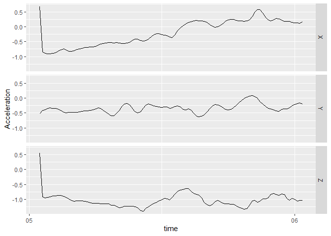

<!-- README.md is generated from README.Rmd. Please edit that file -->

# bis620.2023

<!-- badges: start -->

[](https://github.com/haowangtaka/bis620.2023/actions/workflows/R-CMD-check.yaml)
[](https://codecov.io/gh/haowangtaka/bis620.2023)

<!-- badges: end -->

The goal of bis620.2023 is to …

## Installation

You can install the development version of bis620.2023 from
[GitHub](https://github.com/) with:

``` r
# install.packages("devtools")
devtools::install_github("haowangtaka/bis620.2023")
```

## Example

This is a basic example which shows you how to solve a common problem:

``` r
library(bis620.2023)
accel |> 
  head(100) |> 
  plot_accel()
```



``` r
library(lubridate)
#> 
#> Attaching package: 'lubridate'
#> The following objects are masked from 'package:base':
#> 
#>     date, intersect, setdiff, union
library(dplyr)
#> 
#> Attaching package: 'dplyr'
#> The following objects are masked from 'package:stats':
#> 
#>     filter, lag
#> The following objects are masked from 'package:base':
#> 
#>     intersect, setdiff, setequal, union
library(ggplot2)
library(purrr)
library(tidyr)
library(gridExtra)
#> 
#> Attaching package: 'gridExtra'
#> The following object is masked from 'package:dplyr':
#> 
#>     combine
library(knitr)
library(rmarkdown)
library(maps)
#> 
#> Attaching package: 'maps'
#> The following object is masked from 'package:purrr':
#> 
#>     map
library(utils)
```

``` r
data("studies")
data("countries")
data("documents")
data("designs")

plot_countries_map(studies)
```


    #> TableGrob (1 x 2) "arrange": 2 grobs
    #>   z     cells    name           grob
    #> 1 1 (1-1,1-1) arrange gtable[layout]
    #> 2 2 (1-1,2-2) arrange gtable[layout]

``` r
plot_document_histogram_pie(studies)
```


``` r
x_axis <- get_distinct(studies, "phase")
plot_histogram_uniform_x_axis(studies, "phase", x_axis, "Phase")
```


``` r
query_tbl <- studies |> left_join(designs, by = "nct_id")
x_axis <- get_distinct(designs, "model_flg")
plot_histogram_uniform_x_axis(query_tbl, "model_flg", x_axis, "Model")
```


