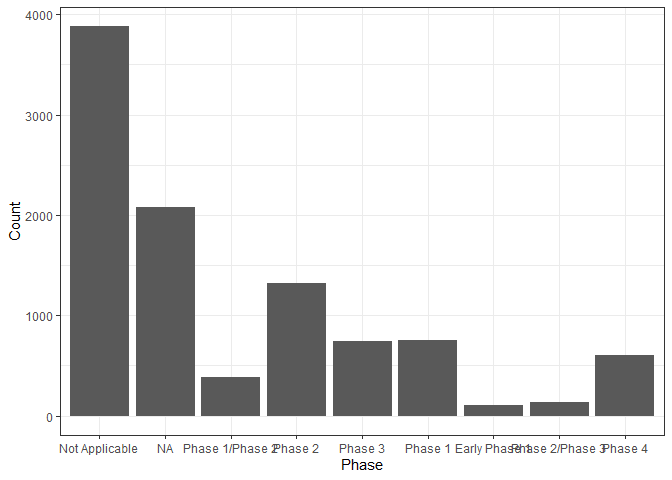

<!-- README.md is generated from README.Rmd. Please edit that file -->

# bis620.2023

<!-- badges: start -->

[](https://github.com/haowangtaka/bis620.2023/actions/workflows/R-CMD-check.yaml)
[](https://codecov.io/gh/haowangtaka/bis620.2023)

<!-- badges: end -->

The bis620.2023 package, developed by Hao Wang, Yixiao Chen, and Qifan
Zhang, offers a robust Shiny application tailored for enhanced
interaction with clinical trial data. Utilizing a subset of data from
ClinicalTrials.gov for testing purposes, the package enables users to
categorize by intervention types and analyze study designs with its
specialized tabs. The Global Study Distribution Map and Document Type
Visualization Tab provide insights into geographical research trends and
document dissemination patterns, respectively. This tool aims to support
research analysis and strategic decision-making in clinical studies,
with potential applications extending to the optimization of research
and development trajectories in healthcare.

## Installation

You can install the development version of bis620.2023 from
[GitHub](https://github.com/) with:

``` r
# install.packages("devtools")
devtools::install_github("haowangtaka/bis620.2023")
#> Downloading GitHub repo haowangtaka/bis620.2023@HEAD
#> rlang   (1.1.1  -> 1.1.2  ) [CRAN]
#> vctrs   (0.6.4  -> 0.6.5  ) [CRAN]
#> stringi (1.7.12 -> 1.8.2  ) [CRAN]
#> cpp11   (0.4.6  -> 0.4.7  ) [CRAN]
#> dplyr   (1.1.3  -> 1.1.4  ) [CRAN]
#> maps    (3.4.1  -> 3.4.1.1) [CRAN]
#> Installing 6 packages: rlang, vctrs, stringi, cpp11, dplyr, maps
#> Installing packages into 'C:/Users/Taka/AppData/Local/Temp/Rtmpa6vLD3/temp_libpath3f687f271f74'
#> (as 'lib' is unspecified)
#> package 'rlang' successfully unpacked and MD5 sums checked
#> package 'vctrs' successfully unpacked and MD5 sums checked
#> package 'stringi' successfully unpacked and MD5 sums checked
#> package 'cpp11' successfully unpacked and MD5 sums checked
#> package 'dplyr' successfully unpacked and MD5 sums checked
#> package 'maps' successfully unpacked and MD5 sums checked
#> 
#> The downloaded binary packages are in
#>  C:\Users\Taka\AppData\Local\Temp\RtmpkdpCMO\downloaded_packages
#> ── R CMD build ─────────────────────────────────────────────────────────────────
#>       ✔  checking for file 'C:\Users\Taka\AppData\Local\Temp\RtmpkdpCMO\remotes3a006f3a182f\haowangtaka-bis620.2023-961da27/DESCRIPTION'
#>       ─  preparing 'bis620.2023':
#>    checking DESCRIPTION meta-information ...     checking DESCRIPTION meta-information ...   ✔  checking DESCRIPTION meta-information
#>       ─  checking for LF line-endings in source and make files and shell scripts
#>       ─  checking for empty or unneeded directories
#>       ─  building 'bis620.2023_0.1.0.tar.gz'
#>      
#> 
#> Installing package into 'C:/Users/Taka/AppData/Local/Temp/Rtmpa6vLD3/temp_libpath3f687f271f74'
#> (as 'lib' is unspecified)
```

## Example

This is a basic example which shows you how to solve a common
problem(created in class):

``` r
library(bis620.2023)
accel |> 
  head(100) |> 
  plot_accel()
```


``` r
library(lubridate)
#> 
#> Attaching package: 'lubridate'
#> The following objects are masked from 'package:base':
#> 
#>     date, intersect, setdiff, union
library(dplyr)
#> Warning: package 'dplyr' was built under R version 4.3.2
#> 
#> Attaching package: 'dplyr'
#> The following objects are masked from 'package:stats':
#> 
#>     filter, lag
#> The following objects are masked from 'package:base':
#> 
#>     intersect, setdiff, setequal, union
library(ggplot2)
library(purrr)
library(tidyr)
library(gridExtra)
#> Warning: package 'gridExtra' was built under R version 4.3.2
#> 
#> Attaching package: 'gridExtra'
#> The following object is masked from 'package:dplyr':
#> 
#>     combine
library(knitr)
library(rmarkdown)
library(maps)
#> Warning: package 'maps' was built under R version 4.3.2
#> 
#> Attaching package: 'maps'
#> The following object is masked from 'package:purrr':
#> 
#>     map
library(utils)
```

Here is the preview of our functions:

``` r
data("studies")
data("countries")
data("documents")
data("interventions")
data("designs")

plot_countries_map(studies)
```


    #> TableGrob (1 x 2) "arrange": 2 grobs
    #>   z     cells    name           grob
    #> 1 1 (1-1,1-1) arrange gtable[layout]
    #> 2 2 (1-1,2-2) arrange gtable[layout]

``` r
plot_document_histogram_pie(studies)
```


``` r
plot_interventions_histogram(studies)
```


``` r
x_axis <- get_distinct(studies, "phase")
plot_histogram_uniform_x_axis(studies, "phase", x_axis, "Phase")
```



``` r
query_tbl <- studies |> left_join(designs, by = "nct_id")
x_axis <- get_distinct(designs, "model_flg")
plot_histogram_uniform_x_axis(query_tbl, "model_flg", x_axis, "Model")
```


